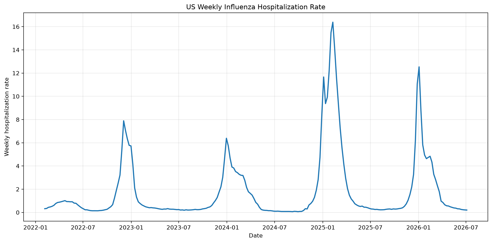
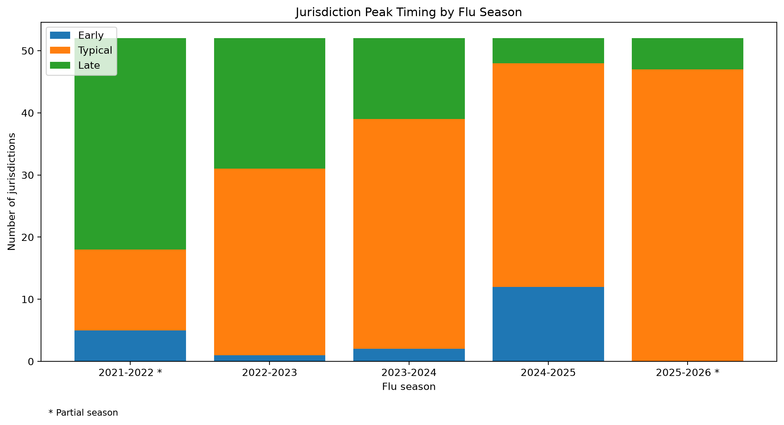
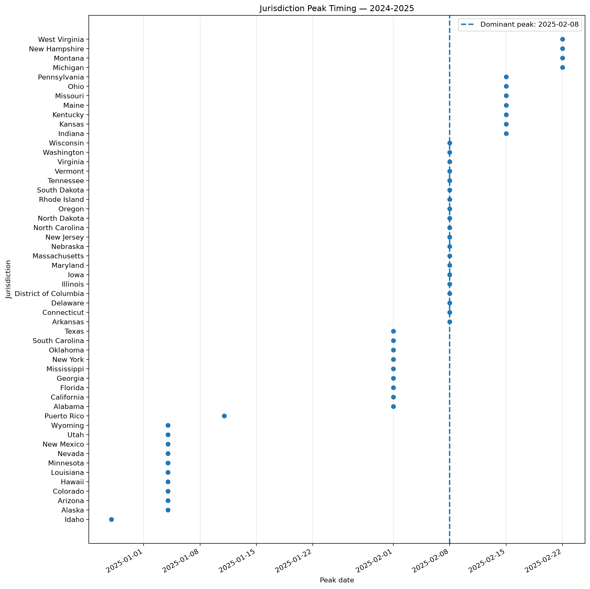
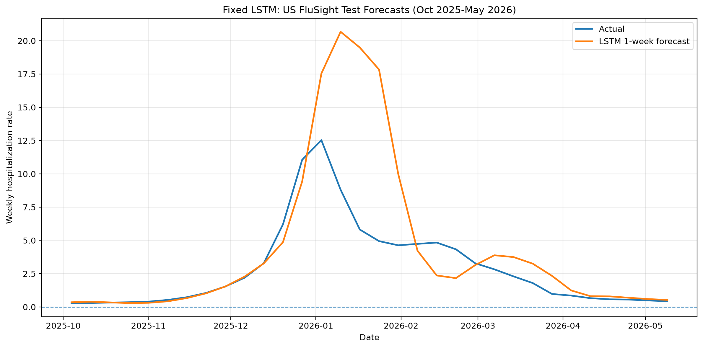
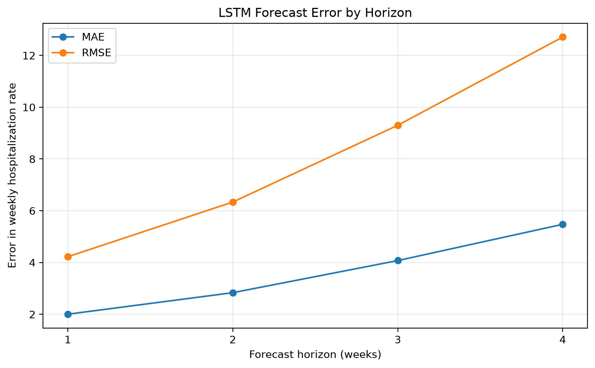

# Agentic Time-Series Analysis Prototype

## Overview

This project is a local research prototype for structured agentic time-series analysis.

It currently includes three major capabilities:

1. **Financial time-series analysis**
   - GPT acts as a retrieval/planning agent.
   - Claude acts as a time-series analysis and feedback agent.
   - Python retrieves real stock-price data through `yfinance`.

2. **CDC FluSight hospitalization analysis**
   - GPT selects an analytical scope.
   - Python performs deterministic preprocessing on influenza hospitalization data.
   - Claude analyzes seasonal and spatiotemporal patterns.
   - The workflow can optionally perform a second-pass analysis using more detailed season-level data.
   - The workflow generates a visual summary as PNG plots.

3. **NeuralForecast LSTM forecasting**
   - A Nixtla NeuralForecast `LSTM` model is trained on U.S. national FluSight data through September 2025.
   - The model is evaluated on October 2025 through May 2026.
   - Forecasts are evaluated at 1-, 2-, 3-, and 4-week horizons.
   - Model weights remain fixed during the test period.

The prototype is inspired by *Structured Agentic Workflows for Financial Time-Series Modeling with LLMs and Reflective Feedback*.

The goal is not to reproduce the full TS-Agent framework. Instead, this implementation explores several core ideas in a smaller and more understandable system:

- specialized agent roles
- external tool use
- structured agent-to-agent communication
- iterative feedback
- stateful workflow execution
- deterministic preprocessing
- scope-aware planning
- visual summaries
- neural forecasting
- logging and traceability
- modular architecture
- automated workflow evaluation

---

## Architecture


### Financial Workflow

```text
User Task
    |
    v
GPT Retriever Agent
    |
    | structured retrieval request
    v
Financial Data Tool (yfinance)
    |
    | time-series observations
    v
Claude Analyst Agent
    |
    | needs more data?
    |
    +---- No ----> Final Analysis
    |
    +---- Yes
            |
            v
      Financial Data Tool
            |
            v
      Expanded Dataset
            |
            v
      Claude Second-Pass Analysis
            |
            v
       Final Analysis

All workflow decisions and results are saved to JSON execution logs.
```

### FluSight Workflow

```text
User Task
    |
    v
Python Dataset Metadata
    |
    v
GPT Planner Agent
    |
    | chooses analysis scope
    |
    +---- latest_season
    |
    +---- cross_season
    |
    +---- all_seasons
            |
            v
Python Builds Scope-Specific Summary
            |
            v
Claude FluSight Analyst
            |
            | needs more detail?
            |
            +---- No ----> Final Analysis
            |
            +---- Yes
                    |
                    v
          Python Detailed Season Summary
                    |
                    v
          Claude Second-Pass Analysis
                    |
                    v
               Final Analysis
                    |
                    v
          Python Visual Summary
                    |
                    v
               PNG Plots

All workflow decisions, results, and generated plot paths are saved to JSON execution logs.
```

---

## Financial Workflow

### 1. User Task

The stock prototype begins with a natural-language request such as:

```text
Analyze NVIDIA's recent stock-price behavior.
Determine whether the recent movement looks unusual
and whether more historical context would be useful.
```

### 2. Retriever Agent

The GPT-based Retriever Agent determines:

- the stock ticker
- an appropriate initial historical period
- why that data is needed

Example:

```json
{
  "symbol": "NVDA",
  "period": "3mo",
  "reason": "Three months provides enough recent context to assess the current movement."
}
```

### 3. Data Retrieval Tool

A Python tool uses `yfinance` to retrieve daily closing-price observations.

The LLM does not generate the financial data itself. Instead:

1. the Retriever Agent decides what data is needed
2. Python executes the retrieval
3. the resulting time-series data is passed to the Analyst Agent

### 4. Analyst Agent

Claude receives:

- the original user task
- the Retriever Agent's structured request
- the retrieved time-series observations

It returns a structured analysis including:

- overall trend
- unusual movements
- whether more historical data is required
- the requested expanded time period
- the reasoning behind the request

### 5. Feedback Loop

If Claude determines that the initial dataset is insufficient, the orchestrator automatically performs another retrieval using the longer requested period.

The expanded dataset is then returned to Claude for a second-pass analysis.

### 6. Execution Logging

Each workflow run is saved as a timestamped JSON file in the `logs/` directory.

---

## CDC FluSight Workflow

The FluSight workflow extends the project from a single financial time series to a multi-location epidemiological dataset.

The local data file is expected at:

```text
data/target-hospital-admissions.csv
```

The dataset contains weekly influenza hospitalization observations across U.S. jurisdictions and the national level.

Expected columns:

```text
date
location
location_name
value
weekly_rate
```

The `data/` directory is ignored by Git and is not committed to the repository.

### Research Questions

The FluSight workflow is designed to explore questions such as:

- Are influenza hospitalizations seasonal?
- When does hospitalization activity peak nationally?
- Do jurisdictions peak at different times?
- Which jurisdictions peak earlier or later than the dominant seasonal peak?
- How do these patterns change across seasons?
- Can the system summarize spatiotemporal variation?
- Can an agent decide when more detailed season-level context is useful?

---

## Planner-Controlled Scope Selection

The GPT planner chooses one of three analytical scopes.

### `latest_season`

Used when the task focuses on the most recent season.

Python builds:

```text
dataset metadata
latest season
detailed latest-season statistics
```

### `cross_season`

Used when the task asks how patterns change across seasons.

Python builds:

```text
dataset metadata
national seasonal peaks
cross-season peak timing summaries
```

### `all_seasons`

Used when the task explicitly asks for detailed analysis of every season.

Python builds:

```text
dataset metadata
national seasonal peaks
detailed summaries for every season
```

The planner therefore changes the downstream data flow instead of only describing what it wants.

---

## Deterministic FluSight Preprocessing

The raw FluSight dataset is not sent directly to Claude.

Instead, Python computes structured features first.

Examples include:

- national seasonal peak dates
- national peak hospitalization counts
- national peak weekly rates
- jurisdiction-level peak dates
- dominant jurisdictional peak date
- peak-date distributions
- early / typical / late timing groups
- jurisdiction-level peak-rate statistics
- timing-group rate statistics
- highest and lowest peak-rate jurisdictions
- partial-season indicators

For each season, Python can compute:

```text
peak-date distribution
dominant peak date
dominant peak count
early / typical / late groups
minimum peak weekly rate
maximum peak weekly rate
mean peak weekly rate
median peak weekly rate
highest peak-rate jurisdictions
lowest peak-rate jurisdictions
```

This creates a separation between deterministic facts and LLM interpretation:

```text
Python
  |
  | deterministic facts
  v
Claude
  |
  | interpretation
  v
Structured analysis
```

---

## FluSight Timing Definitions

Each season uses an August-to-July convention.

Example:

```text
August 2025 through July 2026
-> 2025-2026
```

Jurisdiction peak timing is classified relative to the dominant jurisdictional peak date for that season.

```text
Early:
more than 7 days before the dominant peak

Typical:
within +/- 7 days of the dominant peak

Late:
more than 7 days after the dominant peak
```

These classifications are relative to each season and are not fixed calendar categories.

---

## FluSight Feedback Loop

Claude can optionally request deeper detail for one season.

```text
First Pass
    |
    v
Claude identifies a season that may deserve deeper inspection
    |
    v
Python builds an exact detailed season summary
    |
    v
Claude performs a second-pass analysis
```

The second pass is constrained to terminate the refinement loop.

---

## Scope Enforcement

The planner's selected scope is enforced in both prompts and Python.

For example, if the planner selects:

```text
latest_season
```

Claude may either:

```text
request more detail for the latest season
```

or:

```text
return needs_more_detail = false
```

It may not request a different historical season.

---

## Scientific Interpretation Rules

The FluSight analyst is instructed to separate observed findings from hypotheses requiring additional data.

Potential explanations involving:

- climate
- demographics
- population density
- mobility
- immunity
- influenza strain
- healthcare access
- reporting behavior
- public policy

are not treated as established unless those variables are actually available.

Possible explanations are instead placed under:

```json
{
  "hypotheses_requiring_external_data": []
}
```

---

## Visual Summary Generation

The FluSight workflow generates deterministic visual summaries with Matplotlib.

Current plots include:

1. **U.S. weekly influenza hospitalization rate**
2. **Jurisdiction peak timing by flu season**
3. **Jurisdiction peak dates for a selected season**

Representative outputs are stored in:

```text
plots/
```

The main FluSight workflow automatically generates these plots near the end of a successful run and stores their paths in the JSON execution log.

Example:

```json
{
  "visual_summary": {
    "national_weekly_rate": "plots/national_weekly_hospitalization_rate.png",
    "cross_season_timing_groups": "plots/cross_season_peak_timing_groups.png",
    "season_peak_timing": "plots/jurisdiction_peak_timing_2024_2025.png",
    "selected_season": "2024-2025"
  }
}
```

### Example Visuals







---

## Evaluation Harness

The repository includes:

```text
evaluate_flu.py
```

The evaluator checks:

```text
Planner scope accuracy
Feedback scope compliance
Required output keys
Output length compliance
Workflow completion
```

Three representative task types are evaluated:

```text
cross_season
latest_season
all_seasons
```

A successful evaluation currently produces:

```text
Planner scope accuracy:      3/3
Feedback scope compliance:   3/3
Required output keys:        3/3
Output length compliance:    3/3
Workflow completion:         3/3
```

---

## NeuralForecast LSTM Forecasting

The repository also contains a standalone U.S. national influenza forecasting experiment using Nixtla's NeuralForecast package.

File:

```text
lstm_forecast.py
```

### Forecasting Task

The experiment follows this setup:

```text
Target:
US national weekly influenza hospitalization rate

Training period:
2022-02-05 through 2025-09-27

Test period:
2025-10-04 through 2026-05-30

Forecast horizons:
1, 2, 3, and 4 weeks ahead
```

The model is fitted once before the test period.

During evaluation:

```text
refit=False
```

so the learned LSTM parameters remain fixed throughout the held-out test window.

The test period is evaluated with overlapping 4-week forecast windows using a 1-week step.

### Model

The baseline model uses:

```text
NeuralForecast LSTM
forecast horizon: 4 weeks
input size: 12 weeks
hidden size: 64
max training steps: 300
scaler: standard
frequency: weekly, Saturday
```

### Baseline Results

The fixed-model baseline produced:

| Forecast Horizon | Forecast Count | MAE | RMSE |
| --- | ---: | ---: | ---: |
| 1 week | 32 | 2.0027 | 4.2232 |
| 2 weeks | 32 | 2.8343 | 6.3357 |
| 3 weeks | 32 | 4.0751 | 9.3018 |
| 4 weeks | 32 | 5.4759 | 12.7107 |

Forecast error increases as lead time increases.

The current baseline captures the broad seasonal rise and decline but substantially overpredicts the 2026 hospitalization peak.

### LSTM Visuals





Generated forecast CSV files are written to:

```text
forecast_results/
```

This directory is ignored by Git because the files can be regenerated from the source data and script.

---

## Project Structure

```text
agentic-timeseries/
|
├── agents.py
├── tools.py
├── logger.py
├── visualizations.py
├── lstm_forecast.py
|
├── main.py
├── main_nvda.py
├── main_flu.py
|
├── test_flu.py
├── test_flu_scopes.py
├── evaluate_flu.py
|
├── data/
│   └── target-hospital-admissions.csv
|
├── diagrams/
├── plots/
├── logs/
├── forecast_results/
├── lightning_logs/
|
├── requirements.txt
├── README.md
├── .gitignore
├── .env
└── .venv/
```

### `main.py`

Runs the Apple stock workflow.

### `main_nvda.py`

Runs the NVIDIA stock workflow.

### `main_flu.py`

Runs the full FluSight agentic workflow:

```text
metadata
-> planner
-> scope-specific Python summary
-> first-pass analyst
-> optional detailed retrieval
-> optional second-pass analyst
-> visual summary
-> log
```

### `agents.py`

Contains the LLM-based agents.

Financial workflow:

```text
run_retriever_agent()
run_analyst_agent()
run_second_pass_analyst()
```

FluSight workflow:

```text
run_flu_planner_agent()
run_flu_analyst_agent()
run_flu_second_pass_analyst()
```

### `tools.py`

Contains deterministic financial and epidemiological data tools.

### `visualizations.py`

Generates the FluSight visual summary plots.

### `lstm_forecast.py`

Runs the fixed-model NeuralForecast LSTM experiment and generates forecast metrics and plots.

### `logger.py`

Saves timestamped JSON execution traces to `logs/`.

### `test_flu.py`

Tests deterministic FluSight preprocessing without calling the LLM agents.

### `test_flu_scopes.py`

Tests whether different user tasks produce different planner scopes.

### `evaluate_flu.py`

Runs structured evaluation checks across representative FluSight tasks.

---

# Run on Your Own Machine

## 1. Clone the Repository

```bash
git clone https://github.com/sriixz/agentic-timeseries.git
cd agentic-timeseries
```

## 2. Create a Virtual Environment

```bash
python -m venv .venv
```

### Windows PowerShell

```powershell
Set-ExecutionPolicy -Scope Process -ExecutionPolicy Bypass
.venv\Scripts\Activate.ps1
```

### Windows Command Prompt

```cmd
.venv\Scripts\activate.bat
```

### macOS / Linux

```bash
source .venv/bin/activate
```

## 3. Install Dependencies

```bash
pip install -r requirements.txt
```

This installs the packages required for:

- OpenAI API access
- Anthropic API access
- `yfinance`
- pandas
- Matplotlib
- NeuralForecast
- PyTorch / PyTorch Lightning dependencies

## 4. Add API Keys

Create a `.env` file in the project root:

```text
OPENAI_API_KEY=your_openai_api_key
ANTHROPIC_API_KEY=your_anthropic_api_key
```

API keys should never be committed to version control.

> **Note:** The current agentic workflow uses both OpenAI and Anthropic. A future improvement is to make the model provider configurable so the system can run with a single provider/API key if desired.

## 5. Add the FluSight Dataset

Create:

```text
data/
```

Place the FluSight hospitalization target file at:

```text
data/target-hospital-admissions.csv
```

Expected columns:

```text
date
location
location_name
value
weekly_rate
```

The `data/` directory is ignored by Git.

CDC FluSight forecast hub:

https://github.com/cdcepi/FluSight-forecast-hub

## 6. Run the Financial Demos

Apple:

```bash
python main.py
```

NVIDIA:

```bash
python main_nvda.py
```

## 7. Run the FluSight Agentic Workflow

```bash
python main_flu.py
```

A successful run performs:

```text
dataset metadata
-> GPT planning
-> scope-specific deterministic preprocessing
-> Claude analysis
-> optional detailed-season feedback
-> optional second-pass analysis
-> visual summary generation
-> JSON logging
```

Generated plots are saved in:

```text
plots/
```

Execution logs are saved in:

```text
logs/
```

## 8. Run the FluSight Tests

Deterministic preprocessing:

```bash
python test_flu.py
```

Planner scope behavior:

```bash
python test_flu_scopes.py
```

Evaluation harness:

```bash
python evaluate_flu.py
```

## 9. Generate the Visual Summary Directly

```bash
python visualizations.py
```

This generates the current FluSight plots in:

```text
plots/
```

## 10. Run the NeuralForecast LSTM Experiment

```bash
python lstm_forecast.py
```

The experiment:

```text
trains on:
2022 through September 2025

tests on:
October 2025 through May 2026

produces:
1-4 week ahead forecasts
MAE and RMSE by forecast horizon
forecast visualization
error-by-horizon visualization
```

Generated CSV forecast results are saved in:

```text
forecast_results/
```

Generated plots are saved in:

```text
plots/
```

---

## Models

Current agent model assignments:

```text
Planner / Retriever:
OpenAI GPT-5.4-mini

Analyst:
Anthropic Claude Sonnet 4.5
```

Forecasting model:

```text
Nixtla NeuralForecast LSTM
```

Python handles deterministic retrieval, preprocessing, statistical summaries, visualization, and forecast evaluation.

---

## Logging

Workflow runs are saved as timestamped JSON files.

Example:

```text
logs/run_2026-09-02_23-28-50.json
```

Logs can include:

- user task
- planner decision
- selected scope
- first-pass analysis
- feedback decision
- requested season
- detailed retrieval
- final analysis
- visual summary paths
- errors

---

## Relationship to TS-Agent

The prototype implements a simplified subset of ideas from TS-Agent.

| TS-Agent concept | Current prototype |
| --- | --- |
| Structured workflow | Local Python orchestrator |
| Planner/model-selection logic | GPT planner/retriever |
| External resources | `yfinance` and FluSight data |
| Execution feedback | Claude can request additional detail |
| Iterative refinement | Optional second-pass analysis |
| Memory/context | Workflow state passed between stages |
| Auditability | JSON execution logs |
| Modular architecture | Separate agents, tools, visualization, forecasting, logging, and orchestration |

Several major TS-Agent components are not implemented, including:

- Case Bank
- Financial Time-Series Code Base
- Refinement Knowledge Bank
- automated forecasting-model selection
- automated code refinement
- hyperparameter optimization
- execution-based model training
- multiple iterative refinement cycles

---

## Current Limitations

This is still a research prototype.

Current limitations include:

- the agentic workflow currently depends on cloud-hosted LLM APIs
- the current implementation requires both OpenAI and Anthropic credentials
- only one optional agentic refinement pass is supported
- the LSTM is a baseline rather than a tuned forecasting model
- no automated hyperparameter optimization
- no long-term agent memory
- no vector database
- no formal causal inference
- no sub-state epidemiological analysis
- LLM interpretations can still contain factual or wording errors
- workflow evaluation currently focuses more on control behavior than complete scientific correctness
- forecast accuracy degrades substantially as the prediction horizon increases
- financial outputs are workflow demonstrations, not investment advice

---

## Research Direction

The current implementation is a starting point for studying structured multi-agent workflows for time-series analysis.

Research questions include:

- Does specialization between LLM agents improve performance?
- Do heterogeneous model combinations behave differently from single-model systems?
- When does reflective feedback improve time-series analysis?
- How should agents decide when additional data is necessary?
- Can deterministic preprocessing reduce unsupported numerical claims?
- How often do LLM interpretations remain faithful to Python-generated facts?
- How should scientific workflows separate observed evidence from hypotheses?
- Does planner-controlled data selection improve efficiency or reliability?
- How should forecasting models be incorporated into agentic workflows?
- Can an agent select or critique a forecasting model based on observed performance?

---

## Possible Next Steps

Possible extensions include:

- repeated evaluation across many prompts
- comparing GPT -> Claude against GPT -> GPT
- comparing Claude -> Claude against mixed-model workflows
- automatically validating LLM statements against Python-generated facts
- supporting a single configurable LLM provider
- adding geographic metadata
- adding epidemic duration and curve-shape features
- comparing multiple forecasting architectures
- tuning LSTM hyperparameters
- comparing LSTM with NHITS, NBEATS, or statistical baselines
- adding prediction intervals
- adding nonnegative forecast constraints or transformations
- testing whether feedback materially changes conclusions
- allowing an agent to invoke forecasting models
- testing additional epidemiological, environmental, or economic datasets

---

## Research Motivation

The broader motivation is to understand how LLM agents can operate as components of a structured scientific workflow rather than as standalone text generators.

```text
Python
-> deterministic numerical layer
-> visualization
-> forecasting

LLMs
-> planning
-> interpretation
-> feedback
```

The long-term question is whether this combination can produce time-series analysis that is more adaptive, transparent, and reliable than a single unconstrained model call.
