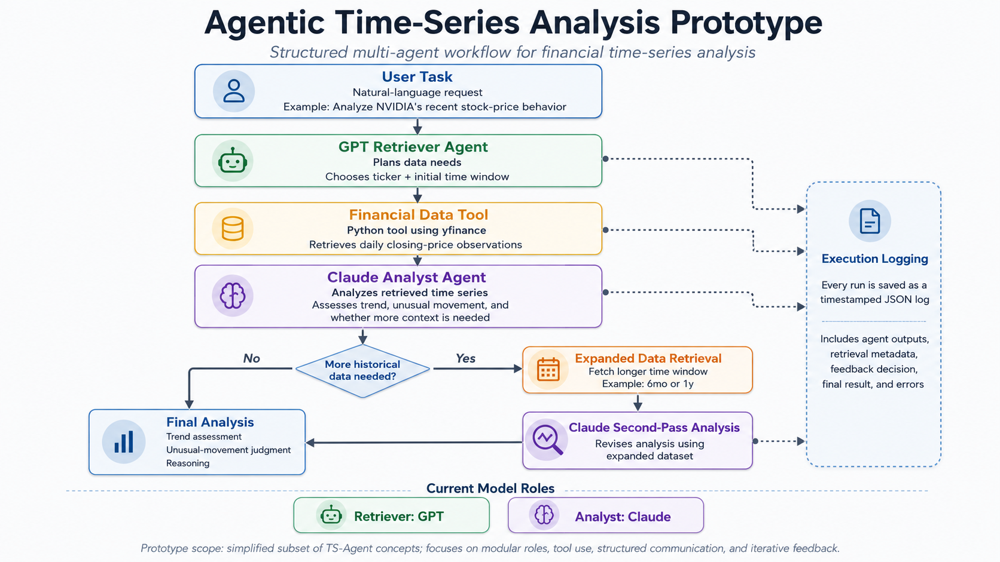

# Agentic Time-Series Analysis Prototype

## Overview

This project is a local research prototype for structured agentic time-series analysis.

It currently includes two workflows:

1. **Financial time-series analysis**
   - GPT acts as a retrieval/planning agent.
   - Claude acts as a time-series analysis and feedback agent.
   - Python retrieves real stock-price data through `yfinance`.

2. **CDC FluSight hospitalization analysis**
   - GPT selects an analytical scope.
   - Python performs deterministic preprocessing on influenza hospitalization data.
   - Claude analyzes seasonal and spatiotemporal patterns.
   - The workflow can optionally perform a second-pass analysis using more detailed season-level data.

The prototype is inspired by *Structured Agentic Workflows for Financial Time-Series Modeling with LLMs and Reflective Feedback*.

The goal is not to reproduce the full TS-Agent framework. Instead, this implementation explores several core ideas in a smaller and more understandable system:

- specialized agent roles
- external tool use
- structured agent-to-agent communication
- iterative feedback
- stateful workflow execution
- deterministic preprocessing
- scope-aware planning
- logging and traceability
- modular architecture
- automated workflow evaluation

---

## Architecture



### Financial Workflow

```text
User Task
    |
    v
GPT Retriever Agent
    |
    | structured retrieval request
    v
Financial Data Tool (yfinance)
    |
    | time-series observations
    v
Claude Analyst Agent
    |
    | needs more data?
    |
    +---- No ----> Final Analysis
    |
    +---- Yes
            |
            v
      Financial Data Tool
            |
            v
      Expanded Dataset
            |
            v
      Claude Second-Pass Analysis
            |
            v
       Final Analysis

All workflow decisions and results are saved to JSON execution logs.
```

### FluSight Workflow

```text
User Task
    |
    v
Python Dataset Metadata
    |
    v
GPT Planner Agent
    |
    | chooses analysis scope
    |
    +---- latest_season
    |
    +---- cross_season
    |
    +---- all_seasons
            |
            v
Python Builds Scope-Specific Summary
            |
            v
Claude FluSight Analyst
            |
            | needs more detail?
            |
            +---- No ----> Final Analysis
            |
            +---- Yes
                    |
                    v
          Python Detailed Season Summary
                    |
                    v
          Claude Second-Pass Analysis
                    |
                    v
               Final Analysis

All workflow decisions and results are saved to JSON execution logs.
```

---

## Financial Workflow

### 1. User Task

The stock prototype begins with a natural-language request such as:

```text
Analyze NVIDIA's recent stock-price behavior.
Determine whether the recent movement looks unusual
and whether more historical context would be useful.
```

### 2. Retriever Agent

The GPT-based Retriever Agent determines:

- the stock ticker
- an appropriate initial historical period
- why that data is needed

Example:

```json
{
  "symbol": "NVDA",
  "period": "3mo",
  "reason": "Three months provides enough recent context to assess the current movement."
}
```

### 3. Data Retrieval Tool

A Python tool uses `yfinance` to retrieve daily closing-price observations.

The LLM does not generate the financial data itself. Instead:

1. the Retriever Agent decides what data is needed
2. Python executes the retrieval
3. the resulting time-series data is passed to the Analyst Agent

### 4. Analyst Agent

Claude receives:

- the original user task
- the Retriever Agent's structured request
- the retrieved time-series observations

It returns a structured analysis including:

- overall trend
- unusual movements
- whether more historical data is required
- the requested expanded time period
- the reasoning behind the request

### 5. Feedback Loop

If Claude determines that the initial dataset is insufficient, the orchestrator automatically performs another retrieval using the longer requested period.

The expanded dataset is then returned to Claude for a second-pass analysis.

This allows the final analysis to incorporate additional context discovered during the first pass rather than relying on a fixed one-shot pipeline.

### 6. Execution Logging

Each workflow run is saved as a timestamped JSON file in the `logs/` directory.

The log records:

- user task
- model assignments
- Retriever Agent output
- first retrieval metadata
- first analysis
- feedback decision
- second retrieval metadata
- final analysis
- workflow status
- errors, if any

Failed runs are logged as well.

---

## CDC FluSight Workflow

The FluSight workflow extends the project from a single financial time series to a multi-location epidemiological dataset.

The local data file is expected at:

```text
data/target-hospital-admissions.csv
```

The dataset contains weekly influenza hospitalization observations across U.S. jurisdictions and the national level.

Expected columns:

```text
date
location
location_name
value
weekly_rate
```

The `data/` directory is ignored by Git and is not committed to the repository.

### Research Questions

The FluSight workflow is designed to explore questions such as:

- Are influenza hospitalizations seasonal?
- When does hospitalization activity peak nationally?
- Do jurisdictions peak at different times?
- Which jurisdictions peak earlier or later than the dominant seasonal peak?
- How do these patterns change across seasons?
- Can the system summarize spatiotemporal variation?
- Can an agent decide when more detailed season-level context is useful?

---

## Planner-Controlled Scope Selection

The GPT planner chooses one of three analytical scopes.

### `latest_season`

Used when the task focuses on the most recent season.

Python builds:

```text
dataset metadata
latest season
detailed latest-season statistics
```

### `cross_season`

Used when the task asks how patterns change across seasons.

Python builds:

```text
dataset metadata
national seasonal peaks
cross-season peak timing summaries
```

### `all_seasons`

Used when the task explicitly asks for detailed analysis of every season.

Python builds:

```text
dataset metadata
national seasonal peaks
detailed summaries for every season
```

The planner therefore changes the downstream data flow instead of only describing what it wants.

---

## Deterministic FluSight Preprocessing

The raw FluSight dataset is not sent directly to Claude.

Instead, Python computes structured features first.

Examples include:

- national seasonal peak dates
- national peak hospitalization counts
- national peak weekly rates
- jurisdiction-level peak dates
- dominant jurisdictional peak date
- peak-date distributions
- early / typical / late timing groups
- jurisdiction-level peak-rate statistics
- timing-group rate statistics
- highest and lowest peak-rate jurisdictions
- partial-season indicators

For each season, Python can compute:

```text
peak-date distribution
dominant peak date
dominant peak count
early / typical / late groups
minimum peak weekly rate
maximum peak weekly rate
mean peak weekly rate
median peak weekly rate
highest peak-rate jurisdictions
lowest peak-rate jurisdictions
```

This creates a separation between deterministic facts and LLM interpretation:

```text
Python
  |
  | deterministic facts
  v
Claude
  |
  | interpretation
  v
Structured analysis
```

---

## FluSight Timing Definitions

Each season uses an August-to-July convention.

Example:

```text
August 2025 through July 2026
-> 2025-2026
```

Jurisdiction peak timing is classified relative to the dominant jurisdictional peak date for that season.

```text
Early:
more than 7 days before the dominant peak

Typical:
within +/- 7 days of the dominant peak

Late:
more than 7 days after the dominant peak
```

These classifications are relative to each season and are not fixed calendar categories.

---

## FluSight Feedback Loop

Claude can optionally request deeper detail for one season.

Example:

```text
First Pass
    |
    v
Claude identifies a season that may deserve deeper inspection
    |
    v
Python builds an exact detailed season summary
    |
    v
Claude performs a second-pass analysis
```

The detailed Python summary can include:

- exact peak-date distribution
- early / typical / late jurisdiction lists
- timing-group counts
- timing-group rate statistics
- jurisdiction-level peak rates
- highest and lowest peak-rate jurisdictions

The second pass is constrained to terminate the refinement loop.

---

## Scope Enforcement

The planner's selected scope is enforced in both prompts and Python.

For example, if the planner selects:

```text
latest_season
```

Claude may either:

```text
request more detail for the latest season
```

or:

```text
return needs_more_detail = false
```

It may not request a different historical season.

This prevents a downstream agent from silently violating the planner's decision.

---

## Scientific Interpretation Rules

The FluSight analyst is instructed to separate observed findings from hypotheses requiring additional data.

Potential explanations involving:

- climate
- demographics
- population density
- mobility
- immunity
- influenza strain
- healthcare access
- reporting behavior
- public policy

are not treated as established unless those variables are actually available.

Possible explanations are instead placed under:

```json
{
  "hypotheses_requiring_external_data": []
}
```

This helps separate descriptive findings from unsupported causal interpretation.

---

## Evaluation Harness

The repository includes:

```text
evaluate_flu.py
```

The evaluator checks:

```text
Planner scope accuracy
Feedback scope compliance
Required output keys
Output length compliance
Workflow completion
```

Three representative task types are evaluated:

```text
cross_season
latest_season
all_seasons
```

A successful evaluation currently produces:

```text
Planner scope accuracy:      3/3
Feedback scope compliance:   3/3
Required output keys:        3/3
Output length compliance:    3/3
Workflow completion:         3/3
```

Evaluation results are saved as timestamped JSON files in `logs/`.

---

## Project Structure

```text
agentic-timeseries/
|
├── agents.py
├── tools.py
├── logger.py
|
├── main.py
├── main_nvda.py
├── main_flu.py
|
├── test_flu.py
├── test_flu_scopes.py
├── evaluate_flu.py
|
├── data/
│   └── target-hospital-admissions.csv
|
├── diagrams/
├── logs/
|
├── requirements.txt
├── README.md
├── .gitignore
├── .env
└── .venv/
```

### `main.py`

Runs the Apple stock workflow.

### `main_nvda.py`

Runs the NVIDIA stock workflow.

### `main_flu.py`

Runs the full FluSight agentic workflow:

```text
metadata
-> planner
-> scope-specific Python summary
-> first-pass analyst
-> optional detailed retrieval
-> optional second-pass analyst
-> log
```

### `agents.py`

Contains the LLM-based agents.

Financial workflow:

```text
run_retriever_agent()
run_analyst_agent()
run_second_pass_analyst()
```

FluSight workflow:

```text
run_flu_planner_agent()
run_flu_analyst_agent()
run_flu_second_pass_analyst()
```

It also handles:

- structured JSON parsing
- Markdown code-fence cleanup
- model-response validation
- API-call failures
- deterministic scope validation

### `tools.py`

Contains deterministic data tools.

Financial:

```text
fetch_stock_data()
```

FluSight:

```text
load_flu_data()
prepare_flu_data()
summarize_flu_dataset()
summarize_national_seasons()
summarize_state_peaks()
summarize_peak_timing()
classify_peak_timing()
summarize_peak_rate_statistics()
summarize_timing_group_rates()
summarize_peak_rate_extremes()
summarize_cross_season_peak_timing()
build_detailed_season_summary()
build_flu_summary_for_scope()
```

### `logger.py`

Saves timestamped JSON execution traces to `logs/`.

### `test_flu.py`

Tests deterministic FluSight preprocessing without calling the LLM agents.

### `test_flu_scopes.py`

Tests whether different user tasks produce different planner scopes.

### `evaluate_flu.py`

Runs structured evaluation checks across multiple representative FluSight tasks.

---

## Setup

### 1. Clone the repository

```bash
git clone https://github.com/sriixz/agentic-timeseries.git
cd agentic-timeseries
```

### 2. Create a virtual environment

```bash
python -m venv .venv
```

PowerShell:

```powershell
Set-ExecutionPolicy -Scope Process -ExecutionPolicy Bypass
.venv\Scripts\Activate.ps1
```

Command Prompt:

```cmd
.venv\Scripts\activate.bat
```

### 3. Install dependencies

```bash
pip install -r requirements.txt
```

### 4. Create `.env`

Create a `.env` file containing:

```text
OPENAI_API_KEY=your_openai_api_key
ANTHROPIC_API_KEY=your_anthropic_api_key
```

API keys should never be committed to version control.

---

## FluSight Data Setup

Create:

```text
data/
```

Place the FluSight hospitalization target file at:

```text
data/target-hospital-admissions.csv
```

The `data/` directory is ignored by Git.

CDC FluSight forecast hub:

https://github.com/cdcepi/FluSight-forecast-hub

---

## Running the Project

Apple stock demo:

```bash
python main.py
```

NVIDIA stock demo:

```bash
python main_nvda.py
```

FluSight deterministic preprocessing test:

```bash
python test_flu.py
```

FluSight full workflow:

```bash
python main_flu.py
```

Planner scope test:

```bash
python test_flu_scopes.py
```

FluSight evaluation harness:

```bash
python evaluate_flu.py
```

---

## Models

Current model assignments:

```text
Planner / Retriever:
OpenAI GPT-5.4-mini

Analyst:
Anthropic Claude Sonnet 4.5
```

Python handles deterministic retrieval, preprocessing, and statistical summaries.

---

## Logging

Workflow runs are saved as timestamped JSON files.

Example:

```text
logs/run_2026-08-31_01-18-29.json
```

Evaluation runs are also logged.

Example:

```text
logs/evaluation_2026-08-31_01-16-24.json
```

Logs can include:

- user task
- planner decision
- selected scope
- first-pass analysis
- feedback decision
- requested season
- detailed retrieval
- final analysis
- errors

---

## Relationship to TS-Agent

The prototype implements a simplified subset of ideas from TS-Agent.

| TS-Agent concept | Current prototype |
| --- | --- |
| Structured workflow | Local Python orchestrator |
| Planner/model-selection logic | GPT planner/retriever |
| External resources | `yfinance` and FluSight data |
| Execution feedback | Claude can request additional detail |
| Iterative refinement | Optional second-pass analysis |
| Memory/context | Workflow state passed between stages |
| Auditability | JSON execution logs |
| Modular architecture | Separate agents, tools, logging, and orchestration |

Several major TS-Agent components are not implemented, including:

- Case Bank
- Financial Time-Series Code Base
- Refinement Knowledge Bank
- automated forecasting-model selection
- automated code refinement
- hyperparameter optimization
- execution-based model training
- multiple iterative refinement cycles

---

## Current Limitations

This is still a research prototype.

Current limitations include:

- only one optional refinement pass
- no statistical forecasting model
- no automated model training
- no hyperparameter tuning
- no long-term agent memory
- no vector database
- no formal statistical hypothesis testing
- no causal inference
- no sub-state epidemiological analysis
- LLM interpretations can still contain factual or wording errors
- evaluation currently focuses primarily on workflow behavior rather than full scientific correctness
- financial outputs are workflow demonstrations, not investment advice

---

## Research Direction

The current implementation is a starting point for studying structured multi-agent workflows for time-series analysis.

Research questions include:

- Does specialization between LLM agents improve performance?
- Do heterogeneous model combinations behave differently from single-model systems?
- When does reflective feedback improve time-series analysis?
- How should agents decide when additional data is necessary?
- How reliable are agentic workflows across repeated runs?
- Can deterministic preprocessing reduce unsupported numerical claims?
- How often do LLM interpretations remain faithful to Python-generated facts?
- How should scientific workflows separate observed evidence from hypotheses?
- Does planner-controlled data selection improve efficiency or reliability?

---

## Possible Next Steps

Possible extensions include:

- repeated evaluation across many prompts
- comparing GPT -> Claude against GPT -> GPT
- comparing Claude -> Claude against mixed-model workflows
- measuring planner consistency across repeated runs
- automatically validating LLM statements against Python-generated facts
- adding geographic metadata
- adding epidemic duration and curve-shape features
- comparing seasons statistically
- detecting recurring jurisdiction-level timing patterns
- testing whether feedback materially changes conclusions
- adding multiple refinement cycles
- testing additional epidemiological, environmental, or economic datasets
- adding forecasting models
- investigating how agent specialization affects time-series reasoning

---

## Research Motivation

The broader motivation is to understand how LLM agents can operate as components of a structured scientific workflow rather than as standalone text generators.

```text
Python
-> deterministic numerical layer

LLMs
-> planning, interpretation, and feedback
```

The long-term question is whether this combination can produce time-series analysis that is more adaptive, transparent, and reliable than a single unconstrained model call.
