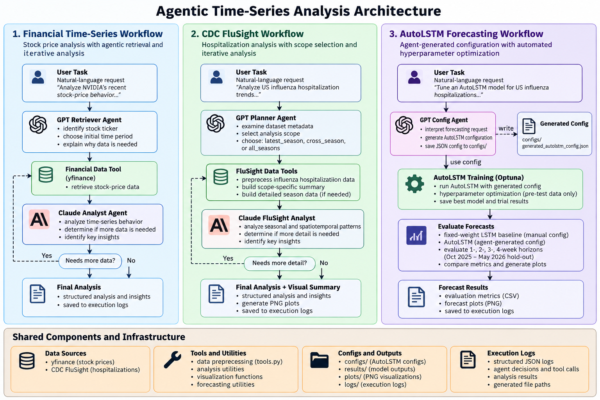

# Agentic Time-Series Analysis Prototype

## Overview

This repository is a local research prototype for structured agentic time-series analysis and forecasting.

It currently explores three related workflows:

1. **Financial time-series analysis**
   - GPT acts as a retrieval/planning agent.
   - Python retrieves stock-price data through `yfinance`.
   - Claude performs structured time-series analysis.
   - Claude can request additional historical context for a second analysis pass.
   - Workflow activity is saved to JSON execution logs.

2. **CDC FluSight hospitalization analysis**
   - GPT selects an analytical scope.
   - Python performs deterministic preprocessing on CDC FluSight hospitalization data.
   - National trend analysis prioritizes raw hospitalization counts (`value`).
   - `weekly_rate` is used as a normalized secondary measure.
   - Claude interprets structured seasonal and jurisdiction-level summaries.
   - Deterministic semantic and structural validation can trigger one constrained repair pass.
   - Claude can optionally request detailed information for one season.
   - Python generates deterministic visual summaries.

3. **Agentic NeuralForecast LSTM / AutoLSTM forecasting**
   - A manually configured NeuralForecast `LSTM` provides a fixed-weight baseline.
   - A GPT configuration agent converts a natural-language forecasting experiment request into structured JSON.
   - The generated configuration defines the dataset scope, temporal split, forecast horizon, and Optuna search space.
   - A generic AutoLSTM trainer reads the generated configuration and performs hyperparameter optimization.
   - The selected LSTM is fitted once on pre-test data and evaluated on the held-out period.
   - Forecast performance is measured separately at 1-, 2-, 3-, and 4-week horizons.

The prototype is inspired by:

> *Structured Agentic Workflows for Financial Time-Series Modeling with LLMs and Reflective Feedback*

The goal is not to reproduce the complete TS-Agent framework. Instead, the project explores several of its core ideas in a smaller research system:

- specialized agent roles
- structured LLM outputs
- external tool use
- deterministic preprocessing
- planner-controlled data flow
- execution feedback
- constrained repair
- configuration generation
- automated hyperparameter optimization
- neural forecasting
- held-out evaluation
- visual summaries
- logging and traceability
- modular workflow design

---

## Architecture



The current repository contains three main workflow paths.

### Financial Workflow

```text
User Task
    |
    v
GPT Retriever Agent
    |
    v
Financial Data Tool
(yfinance)
    |
    v
Claude Analyst Agent
    |
    | needs more data?
    |
    +---- No ----> Final Analysis
    |
    +---- Yes
            |
            v
      Expanded Retrieval
            |
            v
      Claude Second Pass
            |
            v
       Final Analysis
```

### FluSight Analysis Workflow

```text
User Task
    |
    v
Python Dataset Metadata
    |
    v
GPT Planner Agent
    |
    | selects scope
    |
    +---- latest_season
    |
    +---- cross_season
    |
    +---- all_seasons
            |
            v
Python Scope-Specific Summary
            |
            v
Claude FluSight Analyst
            |
            v
Deterministic Validation
            |
            | violations?
            |
            +---- Yes ---> Constrained Repair
            |                  |
            |                  v
            |             Revalidation
            |
            v
Needs More Detail?
    |
    +---- No ----> Final Analysis
    |
    +---- Yes
            |
            v
Python Detailed Season Summary
            |
            v
Claude Second-Pass Analysis
            |
            v
Final Analysis + Visual Summary
```

### Agentic Forecasting Workflow

```text
Natural-Language Experiment Request
                |
                v
        GPT Config Agent
                |
                v
Generated AutoLSTM JSON Configuration
                |
                v
      Generic Config Interpreter
                |
                v
         Optuna / AutoLSTM
                |
                v
      Best Hyperparameters
                |
                v
         Fixed LSTM Fit
                |
                v
Held-Out 1-4 Week Evaluation
                |
                v
      Metrics + CSVs + Plots
```

This separates **experiment specification** from **model execution**:

```text
Agent decides configuration
        |
        v
Trainer executes configuration
```

---

# Financial Time-Series Workflow

## 1. User Task

The financial prototype begins with a natural-language request such as:

```text
Analyze NVIDIA's recent stock-price behavior.

Determine whether the recent movement looks unusual
and whether more historical context would be useful.
```

## 2. GPT Retriever Agent

The Retriever Agent determines:

- stock ticker
- initial historical period
- reason for requesting that period

Example structured output:

```json
{
  "symbol": "NVDA",
  "period": "3mo",
  "reason": "Three months provides recent context for evaluating the current movement."
}
```

## 3. Python Data Retrieval

Python uses `yfinance` to retrieve market observations.

The LLM does not generate the financial data itself.

```text
GPT decides what data is needed
        |
        v
Python retrieves observations
        |
        v
Claude analyzes observations
```

## 4. Claude Analyst

Claude receives:

- the original task
- the structured retrieval request
- retrieved time-series data

The analyst returns structured output describing:

- overall trend
- unusual movements
- whether more historical data is needed
- requested expanded period
- reason for the decision

## 5. Feedback Loop

If additional context is requested:

```text
Initial data
    |
    v
Claude requests longer history
    |
    v
Python retrieves expanded data
    |
    v
Claude performs second analysis
```

## 6. Logging

Financial workflow runs are written as timestamped JSON files under:

```text
logs/
```

---

# CDC FluSight Workflow

The FluSight workflow extends the project from a single financial time series to an epidemiological dataset containing observations across U.S. jurisdictions and the national level.

The local data file is expected at:

```text
data/target-hospital-admissions.csv
```

Expected columns:

```text
date
location
location_name
value
weekly_rate
```

The `data/` directory is ignored by Git.

---

## Research Questions

The FluSight workflow explores questions such as:

- Are influenza hospitalizations seasonal?
- When does national hospitalization activity peak?
- How do peak magnitudes differ across seasons?
- Do jurisdictions peak at different times?
- Which jurisdictions peak earlier or later than the dominant seasonal peak?
- How do timing patterns change between seasons?
- Can an agent determine the appropriate analytical scope?
- Can deterministic preprocessing reduce unsupported LLM claims?
- When should the workflow retrieve more detailed seasonal information?

---

# Planner-Controlled Scope Selection

The GPT planner selects one of three scopes.

## `latest_season`

Used when the task focuses on the latest available season.

Python can provide:

```text
dataset metadata
latest season
latest national trend
latest-season peak information
historical context when explicitly supplied
```

## `cross_season`

Used when the task asks how patterns differ across seasons.

Python can provide:

```text
dataset metadata
national seasonal peaks
cross-season timing summaries
current-vs-past hospitalization comparisons
```

## `all_seasons`

Used when detailed information across every available season is requested.

Python can provide:

```text
dataset metadata
national seasonal peaks
detailed summaries for every season
cross-season timing information
```

The planner therefore changes the downstream data flow rather than merely describing a preferred analysis.

---

# Deterministic FluSight Preprocessing

The raw FluSight dataset is not passed directly to Claude.

Instead, Python computes structured features first.

Examples include:

- national season-level hospitalization-count trends
- week-over-week hospitalization changes
- latest-season peak comparisons
- national peak dates
- national peak hospitalization counts
- national peak weekly rates
- jurisdiction peak dates
- dominant jurisdictional peak dates
- early / typical / late timing classifications
- jurisdiction peak-rate statistics
- timing-group rate statistics
- partial-season indicators

This separates deterministic facts from language-model interpretation:

```text
Python
  |
  | deterministic facts
  v
Claude
  |
  | interpretation
  v
Structured analysis
```

Raw hospitalization counts and normalized rates are intentionally treated differently.

### `value`

Represents weekly hospital admissions.

Used primarily for:

- U.S. national burden
- national seasonal trends
- national peak magnitudes
- week-over-week changes
- comparisons between national seasonal peaks

### `weekly_rate`

Represents a normalized hospitalization measure.

Used primarily for:

- cross-jurisdiction comparison
- jurisdiction-level peak-rate summaries
- normalized timing-group comparisons

---

# FluSight Timing Definitions

A flu season is represented using an August-to-July convention.

Example:

```text
August 2025 through July 2026
-> 2025-2026
```

Jurisdiction timing is classified relative to the season's dominant jurisdiction peak date.

```text
Early:
more than 7 days before the dominant date

Typical:
within +/- 7 days of the dominant date

Late:
more than 7 days after the dominant date
```

These classifications are season-relative rather than fixed calendar categories.

---

# FluSight Feedback and Repair

Claude may optionally request deeper detail for one valid season.

```text
First-pass analysis
        |
        v
Needs more detail?
        |
        +---- No ---> Finish
        |
        +---- Yes
                |
                v
      Python detailed season summary
                |
                v
      Claude second-pass analysis
```

The second pass terminates the retrieval loop.

---

# Semantic and Structural Validation

FluSight analyst output is checked deterministically after generation.

The validator can flag selected failure modes including:

- unsupported causal or mechanistic wording
- unsupported geographic generalizations
- unsupported percentages
- unsupported ratios or fold-change language
- claims about unobserved portions of partial seasons
- selected structural violations
- excessive output lengths

If violations are detected:

```text
Claude output
    |
    v
Deterministic validator
    |
    v
Violations detected
    |
    v
One constrained repair pass
    |
    v
Validator runs again
```

The repair prompt receives:

- original user task
- authoritative Python-generated facts
- original LLM output
- exact validator violations

This layer reduces known failure modes but does **not** guarantee that every natural-language statement is scientifically correct.

---

# FluSight Visualizations

FluSight visualizations are generated deterministically with Matplotlib.

Date-based plots use epidemiological-week labels generated with the `epiweeks` package.

This aligns the visualizations with epidemiological reporting conventions while preserving chronological ordering across calendar-year boundaries.

Current plots include:

1. **U.S. weekly influenza hospitalization rate**
2. **U.S. hospitalization counts by flu season**
3. **Jurisdiction peak timing groups by season**
4. **Jurisdiction peak epiweeks for a selected season**
5. **LSTM / AutoLSTM held-out forecast visualizations**

Representative plots are stored under:

```text
plots/
```

### National weekly rate


### National hospitalization counts by season


### Cross-season jurisdiction timing groups


### Jurisdiction peak epiweeks


---

# Standalone FluSight Trend Analysis

The repository includes:

```text
flu_trend_analysis.py
```

This script performs deterministic national trend analysis using the FluSight `value` column.

It compares the latest available season in the dataset with recent complete seasons.

Reported quantities include:

- latest hospitalization count
- previous-week hospitalization count
- week-over-week change
- week-over-week percentage change
- observed seasonal peak
- peak date
- difference from observed peak
- comparison with previous seasonal peaks

Representative national peaks:

| Season | Status | Peak Date | Peak Admissions |
| --- | --- | --- | ---: |
| 2022-2023 | complete | 2022-12-03 | 26,835 |
| 2023-2024 | complete | 2023-12-30 | 21,720 |
| 2024-2025 | complete | 2025-02-08 | 55,718 |
| 2025-2026 | partial in dataset | 2026-01-03 | 42,626 |

The 2025-2026 season is described as the **latest available season in the dataset**, rather than assuming it is calendar-current.

Generated CSV summaries are written to:

```text
analysis_results/
```

This directory is ignored by Git because the files are reproducible.

---

# Evaluation Harness

The repository includes:

```text
evaluate_flu.py
```

The current evaluator checks workflow-control properties including:

```text
planner scope accuracy
feedback scope compliance
required output keys
output length compliance
workflow completion
```

Representative task categories include:

```text
latest_season
cross_season
all_seasons
```

A previous successful structural evaluation produced:

```text
Planner scope accuracy:      3/3
Feedback scope compliance:   3/3
Required output keys:        3/3
Output length compliance:    3/3
Workflow completion:         3/3
```

This does not constitute full scientific factual evaluation of every natural-language claim.

---

# NeuralForecast LSTM Baseline

The repository includes a manually configured NeuralForecast LSTM experiment:

```text
lstm_forecast.py
```

## Forecasting Task

```text
Target:
US national weekly influenza hospitalization rate

Training observations:
through September 2025

Held-out evaluation:
October 2025 through May 2026

Forecast horizons:
1, 2, 3, and 4 weeks ahead
```

The model is fitted once before the held-out period.

During rolling evaluation:

```text
refit=False
```

so the learned network weights are not updated during the test period.

Later forecast origins may use observations that would have become available by that point, but the model parameters themselves remain fixed.

## Baseline Configuration

```text
NeuralForecast LSTM
forecast horizon: 4 weeks
input size: 12 weeks
encoder hidden size: 64
decoder hidden size: 64
max training steps: 300
scaler: standard
frequency: weekly, Saturday
```

## Baseline Results

| Forecast Horizon | Forecast Count | MAE | RMSE |
| --- | ---: | ---: | ---: |
| 1 week | 32 | 2.0027 | 4.2232 |
| 2 weeks | 32 | 2.8343 | 6.3357 |
| 3 weeks | 32 | 4.0751 | 9.3018 |
| 4 weeks | 32 | 5.4759 | 12.7107 |

Generated forecast outputs are written under:

```text
forecast_results/
```

Generated plots include:

```text
plots/lstm_fixed_us_forecast_test_period.png
plots/lstm_fixed_metrics_by_horizon.png
```

---

# Agent-Generated AutoLSTM Configuration

The forecasting workflow now includes an LLM-controlled experiment-configuration stage.

Files:

```text
config_agent.py
autolstm_forecast.py
run_agentic_lstm.py
```

Configuration artifacts:

```text
configs/autolstm_search_config.json
configs/generated_autolstm_config.json
```

## Natural-Language Experiment Specification

The config agent accepts an experiment description such as:

```text
Train an LSTM forecasting model using US FluSight
weekly hospitalization-rate data.

Use data through September 2025 for training.

Use October 2025 through May 2026 as the held-out
test period.

Forecast 1 to 4 weeks ahead.

Search observation windows using powers of two.

Search the learning rate logarithmically.

Use five Optuna trials.
```

The GPT config agent converts these instructions into structured JSON.

---

## Generated Configuration

The generated configuration contains:

```text
model
location
target
train_end
test_start
test_end
horizon
validation_size
num_samples
frequency
search_space
```

The search space can describe parameters using four generic types:

```text
fixed
categorical
int
float
```

Example:

```json
{
  "learning_rate": {
    "type": "float",
    "low": 0.0001,
    "high": 0.01,
    "log": true
  }
}
```

The generic trainer interprets this as the corresponding Optuna operation.

Conceptually:

```text
JSON specification
        |
        v
trial.suggest_float(...)
```

The trainer therefore does not need a separately hard-coded Optuna statement for every experiment.

---

## Default Search-Space Behavior

The configuration agent contains explicit defaults.

If a user does not specify a parameter, the agent is instructed to preserve its predefined default rather than inventing a new range.

Examples include:

```text
context_size:
[5, 10]

encoder_hidden_size:
[16, 32, 64]

decoder_hidden_size:
[16, 32, 64]

batch_size:
[16, 32]

random_seed:
1 through 20

scaler:
standard
```

Generated configurations are also checked deterministically before being written to disk.

Validation checks include:

- required top-level fields
- unsupported extra fields
- required search parameters
- supported search-space types
- non-empty categorical values
- valid low/high ranges
- invalid simultaneous `log` and `step` settings

---

# AutoLSTM / Optuna Trainer

`autolstm_forecast.py` reads:

```text
configs/generated_autolstm_config.json
```

and constructs the Optuna search dynamically.

The current workflow uses:

```text
NeuralForecast AutoLSTM
backend = optuna
```

with a temporal validation window inside pre-test data.

The held-out test period is not used to select hyperparameters.

After Optuna finishes:

```text
best configuration
        |
        v
standard NeuralForecast LSTM
        |
        v
fit once on pre-test data
        |
        v
rolling held-out evaluation
        |
        v
refit=False
```

The current search uses only a small number of Optuna trials as a proof of concept.

Because Optuna samples configurations stochastically, the winning configuration and held-out metrics can differ between runs.

The project therefore saves each run's:

- Optuna trial table
- winning configuration
- validation loss
- held-out forecasts
- MAE by horizon
- RMSE by horizon
- forecast plots

under:

```text
forecast_results/
plots/
```

---

# One-Command Agentic LSTM Workflow

The complete configuration-generation and training workflow can be started with:

```bash
python run_agentic_lstm.py
```

This performs:

```text
Natural-language experiment request
        |
        v
GPT configuration generation
        |
        v
Deterministic config validation
        |
        v
generated_autolstm_config.json
        |
        v
AutoLSTM / Optuna tuning
        |
        v
winning LSTM configuration
        |
        v
fixed-weight held-out evaluation
```

This is currently the closest part of the repository to the TS-Agent idea of an LLM orchestrating a conventional forecasting model rather than acting as the forecaster itself.

---

# Manual LSTM vs AutoLSTM

The repository also includes:

```text
compare_lstm_models.py
```

The script compares saved manual-LSTM and AutoLSTM results by forecast horizon.

It calculates:

```text
MAE
RMSE
percent MAE improvement
percent RMSE improvement
```

and generates:

```text
plots/lstm_vs_autolstm_mae.png
plots/lstm_vs_autolstm_rmse.png
```

Because the current AutoLSTM workflow can generate different winning configurations across Optuna runs, comparison results should be interpreted as results for the saved run rather than as a universal AutoLSTM performance claim.

---

# Prompt / Code Generation Log

The repository includes:

```text
PROMPT_LOG.md
```

This file documents reconstructed summaries of the main prompts and development instructions used to generate and refine project files.

These are **not verbatim conversation transcripts**.

The purpose of the log is to improve transparency around:

- development-time LLM assistance
- requested code behavior
- architectural changes
- debugging and refinement instructions

The repository distinguishes between:

1. **development-time LLM assistance**
2. **runtime LLM agents used by the application**

Deterministic numerical calculations, model fitting, evaluation, preprocessing, and plotting are executed by Python.

---

# Project Structure

```text
agentic-timeseries/
|
├── agents.py
├── tools.py
├── logger.py
├── visualizations.py
|
├── main.py
├── main_nvda.py
├── main_flu.py
|
├── flu_trend_analysis.py
|
├── lstm_forecast.py
├── autolstm_forecast.py
├── config_agent.py
├── run_agentic_lstm.py
├── compare_lstm_models.py
|
├── test_flu.py
├── test_flu_scopes.py
├── evaluate_flu.py
|
├── configs/
│   ├── autolstm_search_config.json
│   └── generated_autolstm_config.json
|
├── images/
│   └── agentic_timeseries_architecture.png
|
├── data/
│   └── target-hospital-admissions.csv
|
├── plots/
├── logs/
├── analysis_results/
├── forecast_results/
├── lightning_logs/
|
├── PROMPT_LOG.md
├── requirements.txt
├── README.md
├── .gitignore
├── .env
└── .venv/
```

---

# Important Files

## `agents.py`

Contains runtime LLM agents.

Financial workflow functions include:

```text
run_retriever_agent()
run_analyst_agent()
run_second_pass_analyst()
```

FluSight workflow functions include:

```text
run_flu_planner_agent()
run_flu_analyst_agent()
run_flu_second_pass_analyst()
```

The FluSight analyst path also includes deterministic semantic and structural validation.

---

## `tools.py`

Contains deterministic financial and FluSight preprocessing utilities.

---

## `visualizations.py`

Generates FluSight visual-summary plots.

Date-based plots use `epiweeks` to display epidemiological week labels.

---

## `flu_trend_analysis.py`

Runs deterministic national hospitalization-count trend analysis.

---

## `lstm_forecast.py`

Runs the manually configured fixed-weight LSTM baseline.

---

## `config_agent.py`

Uses GPT to convert a natural-language experiment specification into a validated AutoLSTM JSON configuration.

---

## `autolstm_forecast.py`

Reads the generated configuration, dynamically constructs the Optuna search space, performs AutoLSTM tuning, fits the selected LSTM, evaluates the held-out period, and generates forecast outputs.

---

## `run_agentic_lstm.py`

Orchestrates:

```text
prompt
-> config agent
-> generated config
-> AutoLSTM trainer
-> evaluation
```

---

## `compare_lstm_models.py`

Compares manual LSTM and AutoLSTM metrics by forecast horizon.

---

## `main_flu.py`

Runs the FluSight analysis workflow:

```text
metadata
-> planner
-> scope-specific deterministic summary
-> first-pass Claude analysis
-> validation
-> optional constrained repair
-> optional detailed retrieval
-> optional second pass
-> visual summary
-> log
```

---

# Run on Your Own Machine

## 1. Clone the Repository

```bash
git clone https://github.com/sriixz/agentic-timeseries.git
cd agentic-timeseries
```

---

## 2. Create a Virtual Environment

```bash
python -m venv .venv
```

### Windows PowerShell

```powershell
Set-ExecutionPolicy -Scope Process -ExecutionPolicy Bypass
.venv\Scripts\Activate.ps1
```

### Windows Command Prompt

```cmd
.venv\Scripts\activate.bat
```

### macOS / Linux

```bash
source .venv/bin/activate
```

---

## 3. Install Dependencies

```bash
pip install -r requirements.txt
```

Major dependencies include:

- OpenAI Python SDK
- Anthropic Python SDK
- `python-dotenv`
- `yfinance`
- pandas
- Matplotlib
- `epiweeks`
- NeuralForecast
- Optuna
- PyTorch / PyTorch Lightning dependencies

---

## 4. Add API Keys

Create a `.env` file in the project root:

```text
OPENAI_API_KEY=your_openai_api_key
ANTHROPIC_API_KEY=your_anthropic_api_key
```

Never commit API keys to version control.

---

## 5. Add the FluSight Dataset

Create:

```text
data/
```

Place the hospitalization target data at:

```text
data/target-hospital-admissions.csv
```

Expected columns:

```text
date
location
location_name
value
weekly_rate
```

The `data/` directory is ignored by Git.

CDC FluSight Forecast Hub:

https://github.com/cdcepi/FluSight-forecast-hub

---

# Running the Workflows

## Financial Demo — Apple

```bash
python main.py
```

## Financial Demo — NVIDIA

```bash
python main_nvda.py
```

## FluSight Agentic Analysis

```bash
python main_flu.py
```

## Standalone FluSight Trend Analysis

```bash
python flu_trend_analysis.py
```

## FluSight Visualizations

```bash
python visualizations.py
```

## FluSight Deterministic Tests

```bash
python test_flu.py
```

## Planner Scope Tests

```bash
python test_flu_scopes.py
```

## FluSight Evaluation Harness

```bash
python evaluate_flu.py
```

## Manual LSTM Baseline

```bash
python lstm_forecast.py
```

## Generate AutoLSTM Config Only

```bash
python config_agent.py
```

Generated configuration:

```text
configs/generated_autolstm_config.json
```

## Run AutoLSTM Using Generated Config

```bash
python autolstm_forecast.py
```

## Run Complete Agentic Forecast Workflow

```bash
python run_agentic_lstm.py
```

## Compare Manual LSTM and AutoLSTM

```bash
python compare_lstm_models.py
```

---

# Current Model Roles

## LLM Agents

```text
Planner / Retriever / Config Generation:
OpenAI GPT-5.4-mini

Analysis / Repair:
Anthropic Claude Sonnet 4.5
```

## Forecasting Models

```text
Nixtla NeuralForecast LSTM
Nixtla NeuralForecast AutoLSTM
Optuna hyperparameter optimization
```

Python remains responsible for:

- data retrieval
- preprocessing
- deterministic feature construction
- validation
- plotting
- model fitting
- forecasting
- metric calculation

---

# Relationship to TS-Agent

The prototype currently implements a simplified subset of TS-Agent ideas.

| TS-Agent concept | Current prototype |
| --- | --- |
| Structured workflow | Python orchestration |
| Specialized agents | GPT planning/configuration and Claude analysis |
| External data/tools | `yfinance`, FluSight, Python preprocessing |
| Structured communication | JSON agent outputs and configuration files |
| Execution feedback | Claude detail requests, validation/repair, model metrics |
| Iterative analysis | Optional second-pass FluSight analysis |
| Hyperparameter tuning | AutoLSTM with Optuna |
| Agent-directed model setup | GPT-generated AutoLSTM search configuration |
| Deterministic execution | Python / NeuralForecast |
| Auditability | JSON logs, saved configs, CSV results, plots, prompt log |
| Modular architecture | Separate agents, tools, forecasting, visualization, and orchestration |

Important TS-Agent components that are **not yet implemented** include:

- Case Bank
- dedicated time-series model Code Base abstraction
- Refinement Knowledge Bank
- forecasting-model selection across multiple model families
- automated training-code modification
- execution-based accept/revert code refinement
- repeated multi-cycle model refinement
- persistent long-term agent memory

The current config-agent workflow is therefore a limited but concrete step toward agent-directed forecasting execution.

---

# Current Limitations

This remains a research prototype.

Current limitations include:

- runtime agents depend on cloud-hosted LLM APIs
- the broader analysis workflow currently uses both OpenAI and Anthropic
- only one optional FluSight repair pass is supported
- semantic validation targets selected failure modes rather than complete factual verification
- AutoLSTM currently tunes only the LSTM family
- the current Optuna search uses a small number of trials
- winning AutoLSTM configurations may vary between runs
- `context_size` is deprecated by the current NeuralForecast LSTM implementation
- `inference_input_size=-1` may be automatically adjusted by NeuralForecast
- there is no persistent long-term agent memory
- there is no vector database
- there is no causal inference layer
- forecasting remains national rather than sub-state
- model selection across architectures is not yet agent-controlled
- probabilistic FluSight forecasting is not yet implemented
- Weighted Interval Score is not yet evaluated
- ensembles are not yet implemented
- financial outputs are workflow demonstrations, not investment advice

---

# Research Direction

The broader research question is:

> Can LLM agents serve as reliable orchestration components inside structured scientific time-series workflows rather than acting as standalone predictors?

Current questions include:

- Does specialization between agents improve workflow reliability?
- Can deterministic preprocessing reduce unsupported numerical claims?
- How faithfully do LLM analyses use Python-generated facts?
- When should an agent request more data?
- How should model configuration be represented for agent control?
- Can an LLM generate useful model-search spaces from experiment descriptions?
- Can model execution feedback guide future agent decisions?
- Should model choice depend on forecast horizon?
- Should model choice depend on epidemic phase?
- Can model disagreement provide useful uncertainty information?
- When should several forecasting models be ensembled rather than selecting a single winner?
- How should probabilistic forecasting be incorporated into the agentic workflow?

---

# Possible Next Steps

Possible extensions include:

- increase the number of Optuna trials
- remove deprecated LSTM configuration fields
- compare multiple forecasting architectures
- add NHITS
- add NBEATS
- add statistical forecasting baselines
- let the agent choose among model families
- build a model-performance memory or Case Bank
- evaluate models by epidemic phase
- evaluate models separately by forecast horizon
- add prediction intervals
- add probabilistic forecasts
- calculate Weighted Interval Score
- compare mean and median ensembles
- implement weighted ensembles
- use disagreement between models as an uncertainty feature
- add execution-based refinement cycles
- allow the agent to keep or revert model/pipeline changes based on validation performance
- expand evaluation across more prompts and tasks
- compare different LLM-agent combinations
- improve automated factual validation
- test additional epidemiological, environmental, and economic datasets

---

# Research Motivation

The long-term goal is to study a system in which different components have clearly separated responsibilities.

```text
Python
-> deterministic numerical layer
-> data processing
-> validation
-> visualization
-> forecasting
-> evaluation

LLMs
-> planning
-> configuration
-> interpretation
-> feedback
```

The central question is whether combining deterministic computation, conventional forecasting models, and structured LLM agents can produce time-series workflows that are more adaptive, transparent, and reliable than a single unconstrained model call.